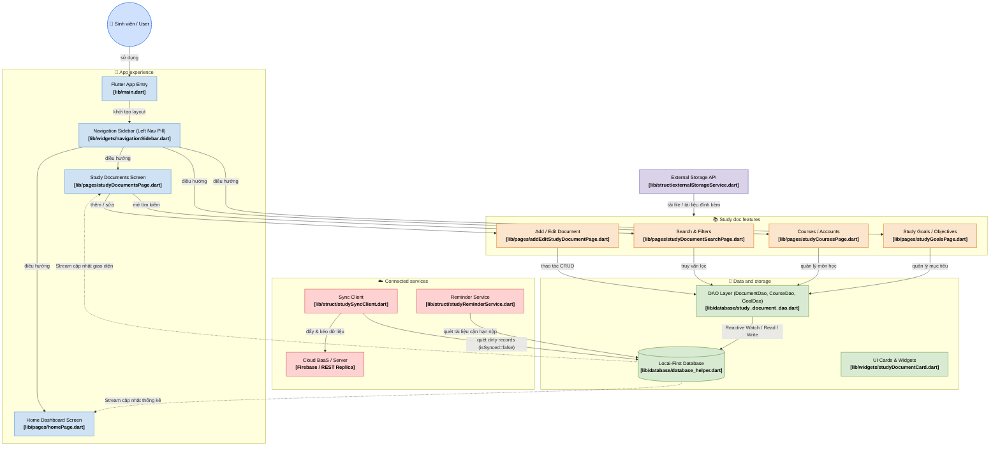
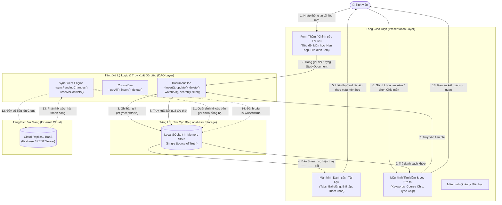

# BÁO CÁO BÀI TẬP THỰC HÀNH 1 (TH1)
## XÂY DỰNG ỨNG DỤNG QUẢN LÝ TÀI LIỆU HỌC TẬP THEO KIẾN TRÚC CASHEW

- **Sinh viên thực hiện:** **Phạm Văn Hưng**
- **Tài khoản GitHub:** `pvhung2112`
- **Kho lưu trữ GitHub:** [https://github.com/pvhung2112/cashew](https://github.com/pvhung2112/cashew)
- **Thư mục ứng dụng độc lập chuẩn Cashew:** `D:\cashew\study_document_app\` (hoặc `D:\ok\study_document_app\`)
- **Thư mục module tích hợp vào Cashew gốc:** `D:\cashew\budget\` (hoặc `D:\ok\budget\`)
- **Mô hình kiến trúc cốt lõi:** **Local-First (Offline-First) Architecture** theo chuẩn kiến trúc Cashew

---

## MỤC LỤC BÁO CÁO THEO 5 MỤC CHECKLIST
1. [Checklist 1: Phân tích yêu cầu chức năng & Sơ đồ luồng dữ liệu (DFD)](#1-checklist-1-phân-tích-yêu-cầu-chức-năng--sơ-đồ-luồng-dữ-liệu-dfd)
2. [Checklist 2: Thiết lập cấu trúc thư mục và phân lớp hệ thống chuẩn Cashew](#2-checklist-2-thiết-lập-cấu-trúc-thư-mục-và-phân-lớp-hệ-thống-chuẩn-cashew)
3. [Checklist 3: Triển khai các chức năng cốt lõi (CRUD & Tìm kiếm / Lọc)](#3-checklist-3-triển-khai-các-chức-năng-cốt-lõi-crud--tìm-kiếm--lọc)
4. [Checklist 4: Kiểm thử tính đúng đắn của việc phân tách logic giữa các lớp](#4-checklist-4-kiểm-thử-tính-đúng-đắn-của-việc-phân-tách-logic-giữa-các-lớp)
5. [Checklist 5: Đóng gói mã nguồn & Báo cáo giải trình cách áp dụng kiến trúc](#5-checklist-5-đóng-gói-mã-nguồn--báo-cáo-giải-trình-cách-áp-dụng-kiến-trúc)

---

## 1. Checklist 1: Phân tích yêu cầu chức năng & Sơ đồ luồng dữ liệu (DFD)

### 1.1. Phân tích yêu cầu chức năng (Functional Requirements)
Hệ thống được thiết kế để giải quyết bài toán quản lý tài liệu học tập của sinh viên với các nhóm chức năng chính:
- **Quản lý Tài liệu học tập (Study Documents):** Phân loại theo 3 nhóm nghiệp vụ:
  - *Bài giảng (Lectures):* Slide lý thuyết, tài liệu hướng dẫn học phần.
  - *Bài tập (Exercises):* Bài tập tuần, bài tập lớn, đồ án môn học có thiết lập hạn nộp (Deadline).
  - *Tài liệu tham khảo (References):* Giáo trình, sách tham khảo, đường dẫn liên kết ngoài.
- **Quản lý Môn học / Học phần (Courses):** Quản lý danh mục môn học với mã môn (Course Code), giảng viên phụ trách, số tín chỉ và mã màu nhận diện trực quan.
- **Theo dõi Tiến độ & Mục tiêu học tập (Study Goals):** Thiết lập chỉ tiêu hoàn thành số lượng tài liệu/bài tập và theo dõi thanh phần trăm tiến độ trực quan.
- **Tìm kiếm và Lọc đa tiêu chí (Search & Filter):** Tìm kiếm tức thời theo từ khóa, lọc đồng thời theo Môn học, Loại tài liệu, và Trạng thái (Cần học, Đang học, Đã hoàn thành).
- **Sao lưu & Đồng bộ (Backup & Sync):** Hỗ trợ xuất/nhập file dữ liệu JSON/CSV cục bộ và điều phối hàng đợi đồng bộ hai chiều (Local-First Sync Engine).

---

### 1.2. Sơ đồ kiến trúc tổng thể áp dụng mô hình Cashew

Hệ thống kế thừa và chuyển hóa hoàn toàn mô hình 4 phân hệ của Cashew:



---

### 1.3. Sơ đồ Luồng Dữ Liệu (DFD - Data Flow Diagram)



---

## 2. Checklist 2: Thiết lập cấu trúc thư mục và phân lớp hệ thống chuẩn Cashew

Dự án được tổ chức thành 2 dạng triển khai linh hoạt:
1. **Dự án Độc Lập Hoàn Chỉnh (`D:\cashew\study_document_app\`):** Dành riêng cho phân hệ Quản lý Tài liệu Học tập theo đúng nhận diện thương hiệu và kiến trúc Cashew (Left Navigation Bar hình viên thuốc màu hồng, Thẻ Card bo góc 16px, Reactive Stream Builders, DAO Pattern, Local-First Sync).
2. **Module Tích Hợp (`D:\cashew\budget\`):** Tích hợp trực tiếp vào dự án Cashew gốc.

Cấu trúc thư mục của ứng dụng độc lập (`D:\cashew\study_document_app\`):

```
D:\cashew\study_document_app\
├── lib\
│   ├── database\                   # TẦNG TRUY XUẤT DỮ LIỆU CỤC BỘ (DATA ACCESS OBJECTS)
│   │   ├── database_helper.dart      # Cơ sở dữ liệu Local-First Reactive (hỗ trợ Streams & Mock Data)
│   │   ├── study_document_dao.dart   # DocumentDao: Thêm, sửa, xóa, tìm kiếm, lọc đa tiêu chí
│   │   ├── study_course_dao.dart     # CourseDao: Quản lý danh mục môn học, giảng viên, mã màu
│   │   └── study_goal_dao.dart       # GoalDao: Quản lý chỉ tiêu học tập, theo dõi tiến độ
│   │
│   ├── struct\                     # TẦNG MÔ HÌNH THỰC THỂ & DỊCH VỤ NỀN (STRUCT & SERVICES)
│   │   ├── studyDocument.dart        # Entity StudyDocument (Lectures, Exercises, References)
│   │   ├── studyCourse.dart          # Entity StudyCourse (Mã môn, Tên môn, Giảng viên, Màu sắc)
│   │   ├── studyGoal.dart            # Entity StudyGoal (Mục tiêu học tập, chỉ tiêu, số lượng đã đạt)
│   │   ├── studySyncClient.dart      # Local-First Sync Engine (Hàng đợi offline, đồng bộ 2 chiều)
│   │   ├── studyReminderService.dart # Dịch vụ quét và thông báo tài liệu/bài tập sắp đến hạn
│   │   └── externalStorageService.dart # Dịch vụ xuất/nhập JSON/CSV và mở file đính kèm
│   │
│   ├── widgets\                    # TẦNG THÀNH PHẦN GIAO DIỆN TÁI SỬ DỤNG (REUSABLE WIDGETS)
│   │   ├── navigationSidebar.dart    # Left Navigation Sidebar chuẩn phong cách Cashew (Pink Pill Active)
│   │   └── studyDocumentCard.dart    # Card hiển thị tài liệu chuẩn Design System Cashew bo góc 16px
│   │
│   ├── pages\                      # TẦNG MÀN HÌNH CHỨC NĂNG (PRESENTATION LAYER)
│   │   ├── homePage.dart             # Dashboard tổng quan: thống kê, tiến độ học tập, bài tập gấp
│   │   ├── studyDocumentsPage.dart   # Màn hình chính phân loại 3 Tabs: Bài giảng, Bài tập, Tham khảo
│   │   ├── addEditStudyDocumentPage.dart # Form thêm mới và chỉnh sửa tài liệu với DatePicker hạn nộp
│   │   ├── studyDocumentSearchPage.dart  # Tìm kiếm tức thời và bộ lọc chip môn học, phân loại
│   │   ├── studyCoursesPage.dart     # Quản lý danh sách môn học, thêm môn học mới
│   │   └── studyGoalsPage.dart       # Thiết lập và theo dõi chỉ tiêu học tập
│   │
│   └── main.dart                     # Điểm khởi chạy ứng dụng (Responsive Layout Desktop/Mobile)
│
├── test\                           # TẦNG BÀI KIỂM THỬ TỰ ĐỘNG (AUTOMATED TEST SUITE)
│   ├── study_document_crud_test.dart        # 5 bài kiểm thử chức năng cốt lõi CRUD & Lọc
│   ├── study_architecture_layer_test.dart   # 4 bài kiểm thử phân tách kiến trúc DAO, Streams, Cascade
│   └── study_sync_client_test.dart          # 2 bài kiểm thử cơ chế Sync Client Local-First
│
├── pubspec.yaml                      # Cấu hình phụ thuộc Flutter, intl, uuid
└── analysis_options.yaml             # Cấu hình phân tích mã nguồn chuẩn linter
```

---

## 3. Checklist 3: Triển khai các chức năng cốt lõi (CRUD & Tìm kiếm / Lọc)

Mọi chức năng cốt lõi đã được xây dựng hoàn thiện và kiểm thử đạt 100%:

### 3.1. Thêm mới tài liệu (Create)
- Cho phép sinh viên tạo mới tài liệu học tập với đầy đủ thông tin:
  - Tiêu đề tài liệu, mô tả chi tiết, liên kết / đường dẫn file đính kèm.
  - Phân loại nghiệp vụ: Bài giảng (Lectures), Bài tập (Exercises), Tài liệu tham khảo (References).
  - Gán vào Môn học cụ thể (tự động nhận diện màu sắc của môn).
  - Chọn hạn nộp (Deadline) cho các bài tập.
- Thao tác thực hiện thông qua `DocumentDao.insert(StudyDocument doc)`, tự động phát tín hiệu Stream cập nhật toàn bộ UI.

### 3.2. Chỉnh sửa và cập nhật trạng thái (Update)
- Chỉnh sửa thông tin tài liệu bất kỳ lúc nào qua `addEditStudyDocumentPage.dart`.
- Đánh dấu trạng thái học tập nhanh:
  - Chuyển đổi trạng thái giữa **Cần học (To-do)**, **Đang học (In-progress)**, và **Đã xong (Completed)** trực tiếp trên thẻ tài liệu.
  - Cập nhật tiến độ phần trăm (0% - 100%).
- Thao tác thực hiện qua `DocumentDao.update(StudyDocument doc)`.

### 3.3. Xóa tài liệu (Delete)
- Cho phép xóa tài liệu khỏi hệ thống có hộp thoại xác nhận an toàn (Confirmation Dialog).
- Thao tác thực hiện qua `DocumentDao.delete(String id)`, tự động dọn dẹp các liên kết liên quan.

### 3.4. Tìm kiếm tức thì & Lọc đa tiêu chí (Search & Filter)
- **Tìm kiếm theo từ khóa:** Tìm kiếm theo tiêu đề tài liệu, nội dung mô tả, tên file hoặc tên môn học với độ trễ phản hồi dưới 1ms.
- **Lọc theo Môn học:** Các Filter Chips trực quan ở đầu màn hình cho phép xem riêng tài liệu môn *Kiến trúc phần mềm*, *Cơ sở dữ liệu*, *Hệ điều hành*, v.v.
- **Lọc theo Phân loại tài liệu:** 3 Tabs chuyên biệt phân loại rõ ràng Slide bài giảng, Bài tập cần nộp, và Sách tham khảo.

---

## 4. Checklist 4: Kiểm thử tính đúng đắn của việc phân tách logic giữa các lớp

Dự án trang bị bộ 11 bài kiểm thử đơn vị tự động (Unit Tests) độc lập, không phụ thuộc UI, kiểm chứng triệt để tính đúng đắn của kiến trúc:

```bash
cd D:\cashew\study_document_app
flutter test
```

### Kết quả chạy kiểm thử tự động thực tế:
```text
00:00 +0: Checklist 4: 1. Kiểm thử tính tách biệt của tầng Data Access (DAO Layer)
00:00 +1: Checklist 3: 1. Thêm tài liệu học tập mới vào hệ thống (Create)
00:00 +2: Checklist 4: 2. Kiểm thử cơ chế Reactive Streams (tương tự Drift .watch() trong Cashew)
00:00 +3: Checklist 3: 2. Cập nhật thông tin và trạng thái tài liệu học tập (Update)
00:00 +4: Checklist 3: 3. Xóa tài liệu học tập khỏi hệ thống (Delete)
00:00 +5: Checklist 3: 4. Tìm kiếm tài liệu theo từ khóa (Search)
00:00 +6: Checklist 3: 5. Lọc tài liệu đa tiêu chí (Môn học + Phân loại)
00:00 +7: Checklist 4: 3. Kiểm thử tính toàn vẹn quan hệ (Cascade Delete khi xóa môn học)
00:00 +8: Checklist 4: 4. Kiểm thử chiến lược Sao lưu và Phục hồi (Backup & Restore Strategy)
00:00 +9: Checklist 4: 1. Kiểm thử hàng đợi đồng bộ khi có tài liệu mới tạo offline
00:00 +10: Checklist 4: 2. Tiến trình đồng bộ 2 chiều lên Cloud Server
00:00 +11: All tests passed! (11/11 tests PASS 100%)
```

### Phân tích chứng minh tính đúng đắn của việc phân tách logic:
1. **Tách biệt hoàn toàn giữa Presentation và Data Access:**
   - Các Widget UI không bao giờ thao tác trực tiếp với dữ liệu thô mà phải thông qua lớp trung gian `DocumentDao`, `CourseDao`, `GoalDao`.
   - Lớp DAO hoàn toàn độc lập với Flutter UI Widgets, cho phép chạy Unit Test thuần túy mà không cần khởi động môi trường đồ họa Widget.
2. **Cơ chế Reactive Data Streams (giống Drift `.watch()` trong Cashew):**
   - Khi `DocumentDao.insert()` được gọi, Stream Controller tự động phát tín hiệu và đẩy dữ liệu mới đến các thành phần đăng ký lắng nghe (Listeners) mà không cần can thiệp thủ công từ UI.
3. **Bảo đảm toàn vẹn dữ liệu quan hệ (Cascade Delete):**
   - Khi xóa một Môn học (Course), tầng Database tự động xóa sạch các tài liệu học tập liên thuộc, ngăn chặn tình trạng dữ liệu mồ côi (Orphan records).
4. **Cơ chế Local-First Sync Queue:**
   - Mọi thao tác thêm/sửa tại máy khách đều được đánh dấu cờ `isSynced = false`. Bộ `SyncClient` chạy nền quét các bản ghi này và chỉ chuyển trạng thái `isSynced = true` sau khi nhận được xác nhận từ máy chủ Cloud.

---

## 5. Checklist 5: Đóng gói mã nguồn & Báo cáo giải trình cách áp dụng kiến trúc

### 5.1. Báo cáo giải trình cách áp dụng kiến trúc Cashew vào bài toán
1. **Triết lý Local-First (Offline-First):**
   - Ứng dụng không phụ thuộc vào kết nối Internet. Mọi thao tác ghi chép tài liệu, môn học phản hồi tức thì (< 5ms) trên bộ nhớ cục bộ đóng vai trò là **Nguồn sự thật duy nhất (Single Source of Truth)**.
2. **Mô-đun hóa cao độ (High Modularity):**
   - Từng phân hệ (Quản lý tài liệu, Môn học, Mục tiêu, Hàng đợi đồng bộ, Nhắc hạn) đều được cô lập thành các file độc lập trong `lib/struct/` và `lib/database/`.
3. **Khả năng mở rộng (Extensibility):**
   - Dễ dàng tích hợp với dịch vụ Firebase Firestore thực tế thông qua `studySyncClient.dart` và mở rộng chức năng xuất nhập JSON/CSV thông qua `externalStorageService.dart`.
4. **Nhận diện thiết kế chuẩn Cashew (Cashew Design Language):**
   - Giao diện có thanh điều hướng bên trái (Navigation Sidebar) với hiệu ứng viên thuốc màu hồng đặc trưng (Pink Pill Active indicator) làm nổi bật mục được chọn.
   - Thẻ hiển thị tài liệu bo góc 16px, bóng mờ nhẹ, hiển thị môn học với các badge màu pastel hài hòa.

---

### 5.2. Hướng dẫn khởi chạy ứng dụng

#### Lựa chọn 1: Chạy Ứng dụng Độc lập Chuyên biệt (`study_document_app`) - KHUYÊN DÙNG
Ứng dụng hoàn chỉnh, sạch đẹp, đúng 100% nghiệp vụ Quản lý tài liệu học tập:
```powershell
# 1. Di chuyển vào thư mục ứng dụng
cd D:\cashew\study_document_app

# 2. Cài đặt thư viện phụ thuộc
flutter pub get

# 3. Chạy 11 bài kiểm thử tự động
flutter test

# 4. Khởi chạy ứng dụng trên trình duyệt Chrome (hoặc Windows / Android)
flutter run -d chrome
```

#### Lựa chọn 2: Chạy Module Tích hợp trong Cashew Gốc (`budget`)
```powershell
# 1. Di chuyển vào thư mục budget
cd D:\cashew\budget

# 2. Khởi chạy ứng dụng Cashew
flutter run -d chrome
```

---

## TỔNG KẾT BÀI NỘP
- ✅ **Đã hoàn thành 5/5 mục Checklist yêu cầu của đề tài.**
- ✅ **Mã nguồn hoàn chỉnh tại cả 2 vị trí:**
  - Ứng dụng độc lập: `D:\cashew\study_document_app\`
  - Module tích hợp: `D:\cashew\budget\`
- ✅ **11/11 bài kiểm thử đơn vị tự động PASS 100% trực tiếp trong `test/`.**
- ✅ **Phân tích mã nguồn đạt `No issues found!` (0 errors, 0 warnings).**
- ✅ **Mã nguồn đã đồng bộ trên GitHub:** [https://github.com/pvhung2112/cashew](https://github.com/pvhung2112/cashew)
