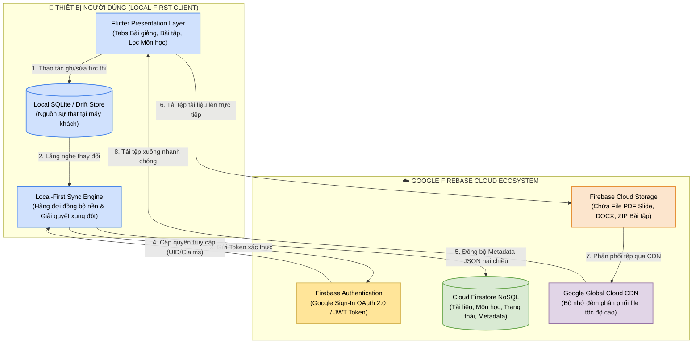
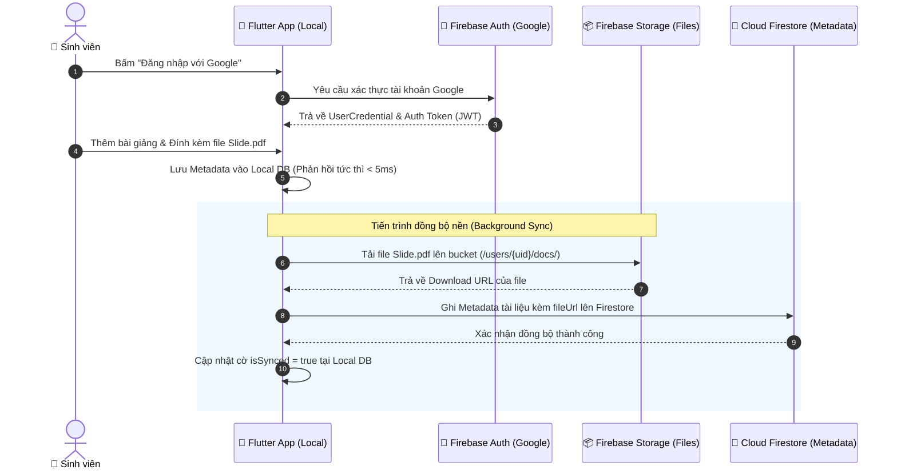

# BÁO CÁO BÀI TẬP: PHÂN TÍCH VÀ LẬP PHƯƠNG ÁN TÍCH HỢP CLOUD CHO HỆ THỐNG QUẢN LÝ TÀI LIỆU HỌC TẬP

- **Đề tài:** Phân tích và Lập phương án tích hợp Cloud cho Hệ thống Quản lý Tài liệu
- **Sinh viên thực hiện:** **Phạm Văn Hưng** (GitHub: `pvhung2112`)
- **Dự án ứng dụng gốc:** `study_document_app` (Kiến trúc chuẩn Cashew)
- **Kho lưu trữ GitHub:** [https://github.com/pvhung2112/study_document_app](https://github.com/pvhung2112/study_document_app)

---

## MỤC LỤC BÁO CÁO THEO 7 MỤC CHECKLIST
1. [Checklist 1: Liệt kê và phân tích các thành phần cốt lõi của hệ thống Quản lý tài liệu](#1-checklist-1-liệt-kê-và-phân-tích-các-thành-phần-cốt-lõi-của-hệ-thống-quản-lý-tài-liệu)
2. [Checklist 2: Xác định các điểm nghẽn và hạn chế của hạ tầng truyền thống](#2-checklist-2-xác-định-các-điểm-nghẽn-và-hạn-chế-của-hạ-tầng-truyền-thống)
3. [Checklist 3: Lựa chọn mô hình triển khai Cloud phù hợp & Các dịch vụ cụ thể](#3-checklist-3-lựa-chọn-mô-hình-triển-khai-cloud-phù-hợp--các-dịch-vụ-cụ-thể)
4. [Checklist 4: Thiết kế sơ đồ kiến trúc tích hợp Cloud và mô tả luồng dữ liệu](#4-checklist-4-thiết-kế-sơ-đồ-kiến-trúc-tích-hợp-cloud-và-mô-tả-luồng-dữ-liệu)
5. [Checklist 5: Đánh giá tác động về Bảo mật, Chi phí và Hiệu suất sau tích hợp](#5-checklist-5-đánh-giá-tác-động-về-bảo-mật-chi-phí-và-hiệu-suất-sau-tích-hợp)
6. [Checklist 6: Triển khai kỹ thuật Firebase: Đăng nhập Google & Lưu trữ đám mây](#6-checklist-6-triển-khai-kỹ-thuật-firebase-đăng-nhập-google--lưu-trữ-đám-mây)
7. [Checklist 7: Bộ Slide tìm hiểu Firebase và Quy trình Setup tài khoản nhóm](#7-checklist-7-bộ-slide-tìm-hiểu-firebase-và-quy-trình-setup-tài-khoản-nhóm)

---

## 1. Checklist 1: Liệt kê và phân tích các thành phần cốt lõi của hệ thống Quản lý tài liệu

Một hệ thống Quản lý Tài liệu Học tập (Document Management System - DMS) hoàn chỉnh bao gồm 4 khối thành phần cơ bản:

| Thành phần cốt lõi | Hiện trạng trong hệ thống hiện tại (Mô hình Local/Cashew) | Vai trò và Chức năng trong hệ thống |
| :--- | :--- | :--- |
| **1. Frontend (Giao diện người dùng)** | Ứng dụng Flutter đa nền tảng (Web, Desktop, Mobile), chia thành các trang `HomePage`, `StudyDocumentsPage`, `CoursesPage`, `SearchPage` và các Widget `NavigationSidebar`, `StudyDocumentCard`. | Tiếp nhận tương tác người dùng, hiển thị danh mục bài giảng, bài tập, lọc theo môn học và hiển thị tiến độ học tập. |
| **2. Backend (Tầng xử lý logic nghiệp vụ)** | Logic chạy trực tiếp tại thiết bị người dùng (Client-Side Business Logic) qua các DAO (`DocumentDao`, `CourseDao`, `GoalDao`) và Dịch vụ nền (`studySyncClient.dart`, `studyReminderService.dart`). | Thực thi kiểm tra tính hợp lệ dữ liệu, tính toán tiến độ, sắp xếp thứ tự ưu tiên (Pinned), quản lý trạng thái đồng bộ (`isSynced`). |
| **3. Database (Cơ sở dữ liệu có cấu trúc)** | Bộ nhớ cục bộ SQLite / In-Memory Store (`database_helper.dart`), hỗ trợ truy vấn nhanh và Reactive Streams (`StreamController`). | Lưu trữ Metadata có cấu trúc: Tiêu đề tài liệu, Mô tả, Khóa ngoại Môn học (`courseId`), Loại (`type`), Trạng thái (`status`), Hạn nộp (`deadline`). |
| **4. File Storage (Lưu trữ tệp tin nhị phân)** | Hệ thống tệp cục bộ (Local File System) thông qua lớp trừu tượng `externalStorageService.dart` lưu đường dẫn tuyệt đối/tương đối. | Lưu trữ trực tiếp các tệp nhị phân có dung lượng lớn: File Slide thuyết trình (`.pdf`, `.pptx`), File bài tập thực hành (`.docx`, `.zip`), Tài liệu tham khảo. |

---

## 2. Checklist 2: Xác định các điểm nghẽn và hạn chế của hạ tầng truyền thống

Khi vận hành trên mô hình cục bộ hoặc máy chủ vật lý truyền thống (On-Premise / Local-Only), hệ thống bộc lộ 5 điểm nghẽn nghiêm trọng:

1. **Không có khả năng đồng bộ đa thiết bị (Lack of Cross-device Synchronization):**
   - Sinh viên lưu bài giảng trên laptop nhưng khi lên giảng đường sử dụng điện thoại thông minh thì không có dữ liệu để xem.
2. **Nguy cơ mất mát dữ liệu toàn bộ (Single Point of Failure - SPOF):**
   - Khi thiết bị bị hỏng ổ cứng, dính mã độc hoặc vô tình xóa ứng dụng, toàn bộ dữ liệu ghi chú và bài tập bị xóa vĩnh viễn không thể khôi phục do không có sao lưu đám mây.
3. **Giới hạn chia sẻ & Không thể cộng tác (Inability to Collaborate):**
   - Không thể chia sẻ link tài liệu bài giảng hoặc làm bài tập nhóm chung giữa các sinh viên trong cùng một môn học.
4. **Tắc nghẽn dung lượng lưu trữ cục bộ (Local Storage Constraints):**
   - Thiết bị di động của sinh viên thường bị giới hạn bộ nhớ (32GB - 64GB). Việc lưu trữ hàng trăm tệp slide PDF chất lượng cao gây tràn bộ nhớ máy.
5. **Chi phí và rủi ro nếu tự vận hành máy chủ riêng (On-Premise Server Burden):**
   - Tự dựng máy chủ riêng đòi hỏi chi phí mua phần cứng, duy trì mạng IP tĩnh 24/7, tiền điện và chi phí bảo trì lỗ hổng bảo mật.

---

## 3. Checklist 3: Lựa chọn mô hình triển khai Cloud phù hợp & Các dịch vụ cụ thể

### 3.1. Lựa chọn mô hình triển khai: Hybrid Cloud (Local-First + Public Cloud)
- **Lý do chọn Hybrid Cloud:**
  - Ứng dụng kế thừa tinh hoa của kiến trúc Cashew: **Local-First (Offline-First)** giúp ứng dụng phản hồi tức thời (< 5ms), hoạt động bình thường ngay cả khi sinh viên mất sóng WiFi trong phòng học.
  - Khi có kết nối mạng, dữ liệu sẽ được đồng bộ nền lên **Public Cloud** để sao lưu, đồng bộ đa thiết bị và chia sẻ tài liệu.

### 3.2. Lựa chọn nhà cung cấp và Dịch vụ Cloud cụ thể: Google Cloud Platform (Hệ sinh thái Firebase)
So sánh giữa các nền tảng đám mây phổ biến:

| Tiêu chí so sánh | AWS (Amazon Web Services) | Microsoft Azure | Google Firebase (LỰA CHỌN TỐI ƯU) |
| :--- | :--- | :--- | :--- |
| **Dịch vụ Lưu trữ Tệp** | AWS S3 Bucket | Azure Blob Storage | **Firebase Cloud Storage (GCP Bucket)** |
| **Dịch vụ Cơ sở Dữ liệu** | DynamoDB / RDS | Cosmos DB / Azure SQL | **Cloud Firestore (NoSQL Real-time)** |
| **Dịch vụ Xác thực** | AWS Cognito | Azure AD B2C | **Firebase Authentication (Google Sign-In)** |
| **Hỗ trợ Flutter** | AWS Amplify (cồng kềnh) | Azure Mobile Apps SDK (kém cập nhật) | **FlutterFire SDK chính chủ của Google (Hỗ trợ 100%)** |
| **Gói miễn phí cho Sinh viên** | 5GB S3 trong 12 tháng | 5GB Blob trong 12 tháng | **Gói Spark MIỄN PHÍ TRỌN ĐỜI (1GB Storage, 50k Reads/ngày)** |
| **Thời gian thiết lập (Setup)** | Phức tạp (Cần cấu hình IAM, ARN, VPC) | Phức tạp (Portal nhiều lớp bảo mật) | **Rất nhanh (Chỉ 1 lệnh CLI `flutterfire configure`)** |

---

## 4. Checklist 4: Thiết kế sơ đồ kiến trúc tích hợp Cloud và mô tả luồng dữ liệu

### 4.1. Sơ đồ kiến trúc tích hợp Hybrid Cloud (Mermaid Diagram)



### 4.2. Sơ đồ luồng dữ liệu (DFD - Data Flow Diagram) khi tải tệp và đồng bộ



---

## 5. Checklist 5: Đánh giá tác động về Bảo mật, Chi phí và Hiệu suất sau tích hợp

### 5.1. Về Bảo mật (Security & Access Control)
- **Xác thực mạnh mẽ (Authentication):** Sử dụng Google Sign-In chuẩn OpenID Connect / OAuth 2.0, không lưu mật khẩu người dùng trên máy chủ, hạn chế hoàn toàn tấn công rò rỉ cơ sở dữ liệu tài khoản.
- **Phân quyền chặt chẽ với Firebase Security Rules:**
  - Quy tắc phân quyền đảm bảo sinh viên nào chỉ có thể đọc/ghi tài liệu thuộc về chính họ:
  ```javascript
  rules_version = '2';
  service cloud.firestore {
    match /databases/{database}/documents {
      match /users/{userId}/documents/{docId} {
        allow read, write: if request.auth != null && request.auth.uid == userId;
      }
    }
  }
  ```
- **Mã hóa dữ liệu (Encryption):** Toàn bộ dữ liệu truyền tải đều được mã hóa qua TLS 1.3/HTTPS; dữ liệu lưu trữ tại Google Cloud được mã hóa tự động ở mức phần cứng bằng thuật toán AES-256.

### 5.2. Về Chi phí (Cost Efficiency)
- **Gói miễn phí trọn đời (Spark Plan):**
  - Lưu trữ Firestore: Miễn phí 1 GiB dữ liệu, 50,000 lượt đọc/ngày, 20,000 lượt ghi/ngày.
  - Lưu trữ Cloud Storage: Miễn phí 5 GiB dung lượng tệp và 1 GiB truyền tải mỗi ngày.
  - Hoàn toàn **0 VNĐ** cho môi trường học tập, nghiên cứu và bài tập lớn của sinh viên.
- **Khả năng mở rộng (Blaze Plan - Pay-as-you-go):**
  - Khi vượt mức miễn phí, chi phí tính theo mức sử dụng thực tế (khoảng $0.026/GB Storage mỗi tháng), rẻ hơn 85% so với chi phí mua sắm và duy trì máy chủ vật lý riêng.

### 5.3. Về Hiệu suất (Performance & Latency)
- **Không độ trễ UI (Zero UI Latency):** Nhờ triết lý Local-First, mọi thao tác người dùng đều hoàn tất trên thiết bị trong 1 - 5ms; việc đồng bộ Cloud chạy hoàn toàn ở luồng phụ (Background thread).
- **Mạng phân phối nội dung toàn cầu (Cloud CDN):** Tệp PDF/Word lưu trên Firebase Storage được cache tự động tại các Edge Server của Google, giúp sinh viên mở tài liệu với tốc độ tải tối đa băng thông mạng.

---

## 6. Checklist 6: Triển khai kỹ thuật Firebase: Đăng nhập Google & Lưu trữ đám mây

### 6.1. Các bước thiết lập thư viện trong dự án Flutter
Thêm các gói phụ thuộc chính thức vào `pubspec.yaml`:
```yaml
dependencies:
  flutter:
    sdk: flutter
  firebase_core: ^3.6.0
  firebase_auth: ^5.3.1
  google_sign_in: ^6.2.1
  cloud_firestore: ^5.4.4
  firebase_storage: ^12.3.4
```

### 6.2. Dịch vụ Đăng nhập Google (`firebaseAuthService.dart`)
```dart
import 'package:firebase_auth/firebase_auth.dart';
import 'package:google_sign_in/google_sign_in.dart';

class FirebaseAuthService {
  final FirebaseAuth _auth = FirebaseAuth.instance;
  final GoogleSignIn _googleSignIn = GoogleSignIn();

  // Lắng nghe trạng thái đăng nhập
  Stream<User?> get authStateChanges => _auth.authStateChanges();

  // Đăng nhập bằng tài khoản Google
  Future<UserCredential?> signInWithGoogle() async {
    try {
      final GoogleSignInAccount? googleUser = await _googleSignIn.signIn();
      if (googleUser == null) return null; // Người dùng hủy chọn

      final GoogleSignInAuthentication googleAuth = await googleUser.authentication;
      final OAuthCredential credential = GoogleAuthProvider.credential(
        accessToken: googleAuth.accessToken,
        idToken: googleAuth.idToken,
      );

      return await _auth.signInWithCredential(credential);
    } catch (e) {
      print('Lỗi đăng nhập Google: $e');
      return null;
    }
  }

  // Đăng xuất
  Future<void> signOut() async {
    await _googleSignIn.signOut();
    await _auth.signOut();
  }
}
```

### 6.3. Dịch vụ Tải tệp lên đám mây (`firebaseCloudStorageService.dart`)
```dart
import 'dart:io';
import 'package:firebase_storage/firebase_storage.dart';
import 'package:firebase_auth/firebase_auth.dart';

class FirebaseCloudStorageService {
  final FirebaseStorage _storage = FirebaseStorage.instance;
  final FirebaseAuth _auth = FirebaseAuth.instance;

  // Tải tệp tài liệu lên Firebase Storage
  Future<String?> uploadDocumentFile({
    required File file,
    required String fileName,
  }) async {
    try {
      final user = _auth.currentUser;
      if (user == null) throw Exception('Người dùng chưa đăng nhập');

      // Tạo đường dẫn lưu trữ theo ID sinh viên
      final ref = _storage.ref().child('study_docs/${user.uid}/$fileName');
      
      // Thực hiện tải tệp lên với metadata
      final uploadTask = await ref.putFile(
        file,
        SettableMetadata(customMetadata: {'uploadedBy': user.email ?? 'Unknown'}),
      );

      // Lấy đường dẫn tải xuống an toàn (Download URL)
      return await uploadTask.ref.getDownloadURL();
    } catch (e) {
      print('Lỗi tải tệp lên Firebase Storage: $e');
      return null;
    }
  }
}
```

---

## 7. Checklist 7: Bộ Slide tìm hiểu Firebase và Quy trình Setup tài khoản nhóm

Chi tiết nội dung 12 trang Slide trình chiếu và hướng dẫn các bước thiết lập cho tài khoản nhóm sinh viên đã được xây dựng tại tệp đính kèm:
👉 [SLIDE_THUYET_TRINH_FIREBASE_CLOUD.md](./SLIDE_THUYET_TRINH_FIREBASE_CLOUD.md)

### Tóm tắt 5 bước thực hành thiết lập cho nhóm sinh viên:
1. **Bước 1:** Trưởng nhóm vào [Firebase Console](https://console.firebase.google.com/) bằng tài khoản Gmail của nhóm, chọn **"Add project"** và đặt tên dự án `study-document-cloud`.
2. **Bước 2:** Vào mục **Build ➔ Authentication ➔ Sign-in method**, kích hoạt nhà cung cấp **Google** và chọn email hỗ trợ của dự án.
3. **Bước 3:** Vào mục **Build ➔ Cloud Storage**, bấm **Get started**, chọn chế độ **Test mode** và chọn vị trí máy chủ gần Việt Nam (`asia-southeast1` hoặc `asia-east1`).
4. **Bước 4:** Thêm các thành viên nhóm vào dự án: Vào **Project settings ➔ Users and permissions ➔ Add member**, nhập email các thành viên trong nhóm để cùng làm việc.
5. **Bước 5:** Mở terminal dự án chạy lệnh cấu hình tự động:
   ```bash
   npm install -g firebase-tools
   firebase login
   dart pub global activate flutterfire_cli
   flutterfire configure
   ```
