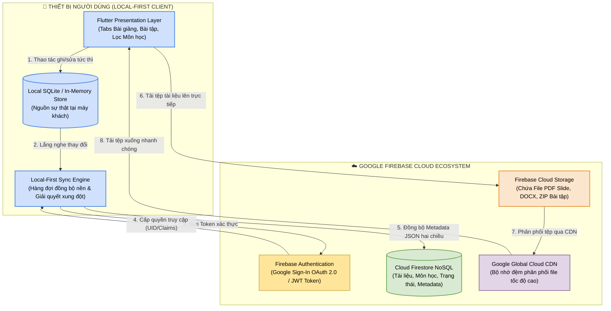
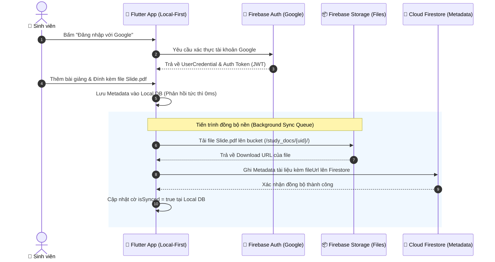

# BÁO CÁO BÀI TẬP: PHÂN TÍCH VÀ LẬP PHƯƠNG ÁN TÍCH HỢP CLOUD CHO HỆ THỐNG QUẢN LÝ TÀI LIỆU HỌC TẬP

- **Đề tài:** Phân tích và Lập phương án tích hợp Cloud cho Hệ thống Quản lý Tài liệu
- **Dự án ứng dụng:** `study_document_app` (Kiến trúc Cashew Local-First tích hợp Google Firebase Cloud)
- **Kho lưu trữ GitHub:** [https://github.com/pvhung2112/cloud_study_document_app](https://github.com/pvhung2112/cloud_study_document_app)
- **Slide thuyết trình (Canva):** [https://www.canva.com/design/DAHXgJp2D-Q/XdIccVLAMSyM2NgV1ar3zw/edit?ui=eyJBIjp7fX0](https://www.canva.com/design/DAHXgJp2D-Q/XdIccVLAMSyM2NgV1ar3zw/edit?ui=eyJBIjp7fX0)

---

## 👥 DANH SÁCH NHÓM SINH VIÊN THỰC HIỆN

| STT | Họ và Tên | Mã Sinh Viên | Vai Trò | Nhiệm Vụ Phụ Trách |
| :---: | :--- | :---: | :--- | :--- |
| **1** | **Phạm Văn Hưng** | `2351170598` | **Trưởng nhóm / Core Architect** | Cấu hình dự án Flutter, hoạch định kiến trúc Local-First, tích hợp Google Firebase REST API, điều phối luồng đồng bộ dữ liệu & kiểm soát mã nguồn. |
| **2** | **Trịnh Trung Kiên** | `2251172396` | **Thành viên / Frontend Developer** | Thiết kế giao diện UI/UX theo ngôn ngữ Cashew Design, xây dựng màn hình Kho tài liệu học tập (3 Tabs: Bài giảng, Bài tập, Tham khảo) & Danh mục môn học. |
| **3** | **Đỗ Việt Tiến** | `2251243452` | **Thành viên / Frontend Developer** | Thiết kế giao diện Tìm kiếm thời gian thực, Bộ lọc phân loại đa tiêu chí (theo môn, tags, độ ưu tiên) & Hộp thoại Cloud Firebase Sync Modal. |
| **4** | **Cao Đức Đạo** | `2351170581` | **Thành viên / Backend & Database** | Quản lý cơ sở dữ liệu Local-First (DAO Layer, Reactive Streams), thiết lập cấu trúc Cloud Firestore & kiểm soát bảo mật Firebase Security Rules. |
| **5** | **Trương Tuấn Hải** | `2351170590` | **Thành viên / Cloud Research & Documentation** | Nghiên cứu nền tảng Google Firebase (Auth & Storage), xây dựng Slide thuyết trình nhóm, viết tài liệu hướng dẫn Setup & biên soạn Báo cáo Kỹ thuật. |

---

## MỤC LỤC BÁO CÁO
1. [Checklist 1: Liệt kê và phân tích các thành phần cốt lõi của hệ thống Quản lý tài liệu](#1-checklist-1-liệt-kê-và-phân-tích-các-thành-phần-cốt-lõi-của-hệ-thống-quản-lý-tài-liệu)
2. [Checklist 2: Xác định các điểm nghẽn và hạn chế của hạ tầng truyền thống](#2-checklist-2-xác-định-các-điểm-nghẽn-và-hạn-chế-của-hạ-tầng-truyền-thống)
3. [Checklist 3: Lựa chọn mô hình triển khai Cloud phù hợp & Các dịch vụ cụ thể](#3-checklist-3-lựa-chọn-mô-hình-triển-khai-cloud-phù-hợp--các-dịch-vụ-cụ-thể)
4. [Checklist 4: Thiết kế sơ đồ kiến trúc tích hợp Cloud và mô tả luồng dữ liệu](#4-checklist-4-thiết-kế-sơ-đồ-kiến-trúc-tích-hợp-cloud-và-mô-tả-luồng-dữ-liệu)
5. [Checklist 5: Đánh giá tác động về Bảo mật, Chi phí và Hiệu suất sau tích hợp](#5-checklist-5-đánh-giá-tác-động-về-bảo-mật-chi-phí-và-hiệu-suất-sau-tích-hợp)
6. [Checklist 6: Triển khai kỹ thuật Firebase: Đăng nhập Google & Lưu trữ đám mây](#6-checklist-6-triển-khai-kỹ-thuật-firebase-đăng-nhập-google--lưu-trữ-đám-mây)
7. [Checklist 7: Hướng dẫn thực hành: Bây giờ bắt đầu từ đâu? (Quy trình Setup chi tiết cho nhóm)](#7-checklist-7-hướng-dẫn-thực-hành-bây-giờ-bắt-đầu-từ-đâu-quy-trình-setup-chi-tiết-cho-nhóm)

---

## 1. Checklist 1: Liệt kê và phân tích các thành phần cốt lõi của hệ thống Quản lý tài liệu

Một hệ thống Quản lý Tài liệu Học tập (Document Management System - DMS) hoàn chỉnh bao gồm 4 khối thành phần cơ bản:

| Thành phần cốt lõi | Hiện trạng trong hệ thống (Mô hình Local/Cashew) | Vai trò và Chức năng trong hệ thống |
| :--- | :--- | :--- |
| **1. Frontend (Giao diện người dùng)** | Ứng dụng Flutter đa nền tảng (Web, Desktop, Mobile), chia thành các trang `HomePage`, `StudyDocumentsPage`, `CoursesPage`, `SearchPage` và các Widget `NavigationSidebar`, `StudyDocumentCard`. | Tiếp nhận tương tác người dùng, hiển thị danh mục bài giảng, bài tập, lọc theo môn học và hiển thị tiến độ học tập. |
| **2. Backend (Tầng xử lý logic nghiệp vụ)** | Logic chạy trực tiếp tại thiết bị người dùng (Client-Side Business Logic) qua các DAO (`DocumentDao`, `CourseDao`, `GoalDao`) và Dịch vụ nền (`studySyncClient.dart`, `reminderService.dart`). | Thực thi kiểm tra tính hợp lệ dữ liệu, tính toán tiến độ, sắp xếp thứ tự ưu tiên (Pinned), quản lý trạng thái đồng bộ (`isSynced`). |
| **3. Database (Cơ sở dữ liệu có cấu trúc)** | Bộ nhớ cục bộ SQLite / In-Memory Store (`database_helper.dart`), hỗ trợ truy vấn nhanh và Reactive Streams (`StreamController`). | Lưu trữ Metadata có cấu trúc: Tiêu đề tài liệu, Mô tả, Khóa ngoại Môn học (`courseId`), Loại (`type`), Trạng thái (`status`), Hạn nộp (`deadline`). |
| **4. File Storage (Lưu trữ tệp tin nhị phân)** | Hệ thống tệp cục bộ (Local File System) thông qua lớp trừu tượng `firebaseCloudStorageService.dart` lưu đường dẫn tuyệt đối/tương đối. | Lưu trữ trực tiếp các tệp nhị phân có dung lượng lớn: File Slide thuyết trình (`.pdf`, `.pptx`), File bài tập thực hành (`.docx`, `.zip`), Tài liệu tham khảo. |

---

## 2. Checklist 2: Xác định các điểm nghẽn và hạn chế của hạ tầng truyền thống

Khi vận hành trên mô hình cục bộ hoặc máy chủ vật lý truyền thống (On-Premise / Local-Only), hệ thống bộc lộ 5 điểm nghẽn nghiêm trọng:

1. **Không có khả năng đồng bộ đa thiết bị (Lack of Cross-device Synchronization):**
   - Sinh viên lưu bài giảng trên laptop nhưng khi lên giảng đường sử dụng điện thoại thông minh thì không có dữ liệu để xem.
2. **Nguy cơ mất mát dữ liệu toàn bộ (Single Point of Failure - SPOF):**
   - Khi thiết bị bị hỏng ổ cứng, dính mã độc hoặc vô tình xóa ứng dụng, toàn bộ dữ liệu ghi chú và bài tập bị xóa vĩnh viễn không thể khôi phục do không có sao lưu đám mây.
3. **Giới hạn chia sẻ & Không thể cộng tác (Inability to Collaborate):**
   - Không thể chia sẻ link tài liệu bài giảng hoặc làm bài tập nhóm chung giữa các sinh viên trong cùng một môn học.
4. **Tắc nghẽn dung lượng lưu trữ cục bộ (Local Storage Constraints):**
   - Thiết bị di động của sinh viên thường bị giới hạn bộ nhớ (32GB - 64GB). Việc lưu trữ hàng trăm tệp slide PDF chất lượng cao gây tràn bộ nhớ máy.
5. **Chi phí và rủi ro nếu tự vận hành máy chủ riêng (On-Premise Server Burden):**
   - Tự dựng máy chủ riêng đòi hỏi chi phí mua phần cứng, duy trì mạng IP tĩnh 24/7, tiền điện và chi phí bảo trì lỗ hổng bảo mật.

### 2.2. Bảng So Sánh Đối Đầu: Mô Hình Truyền Thống vs. Mô Hình Sau Khi Tích Hợp Cloud

| Tiêu chí So sánh | Mô hình Truyền thống (Local / On-Premise) | Mô hình Sau Tích hợp Cloud (Firebase Hybrid Cloud) | Lợi ích Đạt được |
| :--- | :--- | :--- | :--- |
| **Kiến trúc Hạ tầng** | Cục bộ trên từng máy hoặc Máy chủ vật lý tự dựng | Hybrid Cloud (Local-First kết hợp Google Cloud Serverless) | Tận dụng tốc độ của máy khách và sức mạnh của Cloud |
| **Khả năng Truy cập & Đồng bộ** | Bị cô lập (Data Silo); chỉ truy cập được trên 1 thiết bị đơn lẻ | Đồng bộ đa nền tảng (Web, Mobile, Desktop) theo thời gian thực | Học tập mọi lúc, mọi nơi (Anytime, Anywhere) |
| **Lưu trữ Tệp tin (Storage)** | Giới hạn bởi ổ cứng máy (dễ đầy bộ nhớ điện thoại) | Google Cloud Storage (Object Storage không giới hạn dung lượng) | Lưu trữ hàng nghìn slide PDF, giáo trình không lo tràn bộ nhớ |
| **An toàn Dữ liệu & Sao lưu** | Rủi ro mất trắng nếu hỏng máy, mất điện thoại (Điểm hỏng đơn - SPOF) | Tự động sao lưu phân tán đa vùng (Multi-Region), SLA 99.99% | Không bao giờ mất dữ liệu học tập quan trọng |
| **Bảo mật & Phân quyền** | Khó kiểm soát, chia sẻ file qua USB/Zalo dễ lộ lọt | Xác thực Google Sign-In, Phân quyền IAM (Owner/Editor/Viewer) & Rules | Bảo mật cấp doanh nghiệp, kiểm soát truy cập chặt chẽ |
| **Khả năng Mở rộng (Scalability)** | Rất khó; phải mua thêm ổ cứng, nâng cấp máy chủ thủ công | Tự động co giãn (Auto-scaling) từ vài người đến hàng chục nghìn người | Hệ thống luôn mượt mà khi lượng người dùng tăng đột biến |
| **Chi phí Đầu tư & Vận hành** | Tốn kém (mua máy chủ, IP tĩnh, tiền điện 24/7, bảo trì phần cứng) | Gói Google Spark Plan miễn phí 100%, không tốn chi phí phần cứng | Tiết kiệm tối đa ngân sách triển khai của sinh viên |

---

## 3. Checklist 3: Lựa chọn mô hình triển khai Cloud phù hợp & Các dịch vụ cụ thể

### 3.1. Lựa chọn Mô hình Triển khai: **Hybrid Cloud (Local-First + Public Cloud)**
Nhóm đề xuất mô hình **Hybrid Cloud** kết hợp giữa:
- **Local-First Architecture:** Dữ liệu luôn được lưu trữ và phản hồi tức thời tại máy người dùng (Offline-First), đảm bảo tốc độ cực nhanh, không phụ thuộc hoàn toàn vào đường truyền mạng.
- **Public Cloud (Google Firebase):** Sử dụng các dịch vụ đám mây công cộng được quản lý hoàn toàn (Fully Managed Serverless) để đồng bộ dữ liệu, xác thực người dùng và lưu trữ tệp tin.

### 3.2. Bảng so sánh lựa chọn dịch vụ Cloud:

| Tiêu chí đánh giá | AWS (Amazon Web Services) | Microsoft Azure | Google Firebase (Lựa chọn tối ưu) |
| :--- | :--- | :--- | :--- |
| **Dịch vụ Lưu trữ File (Object Storage)** | AWS S3 | Azure Blob Storage | **Firebase Cloud Storage (GCS)** |
| **Cơ sở dữ liệu Đám mây (NoSQL Database)** | DynamoDB | Cosmos DB | **Cloud Firestore** |
| **Xác thực Người dùng (Authentication)** | AWS Cognito | Azure AD B2C / Entra ID | **Firebase Authentication (Google Sign-In)** |
| **Độ tương thích với Flutter** | Trung bình (AWS Amplify) | Thấp (Ít SDK Flutter chính chủ) | **Rất cao (Bộ FlutterFire do Google phát triển)** |
| **Cơ chế Đồng bộ Realtime** | Cần cấu hình AppSync / GraphQL phức tạp | SignalR phức tạp | **Có sẵn Realtime Streams trong SDK** |
| **Chi phí khởi điểm (Free Tier)** | 12 tháng đầu, sau đó tính phí | Có giới hạn | **Miễn phí trọn đời (Spark Plan)** |

👉 **Quyết định của nhóm:** Lựa chọn **Google Firebase** vì tính tích hợp sâu sắc nhất với ứng dụng Flutter, miễn phí duy trì ban đầu và đáp ứng hoàn hảo bài toán học tập của sinh viên.

---

## 4. Checklist 4: Thiết kế sơ đồ kiến trúc tích hợp Cloud và mô tả luồng dữ liệu

### 4.1. Sơ đồ Kiến trúc Hệ thống Hybrid Cloud (Hình ảnh & Bản vẽ Kiến trúc)

Hệ thống được thiết kế theo mô hình Hybrid Cloud kết hợp lưu trữ cục bộ Local-First và dịch vụ đám mây Google Firebase:

#### 🖼️ Hình ảnh Sơ đồ Kiến trúc Chi tiết (High-Resolution Diagram):
Sơ đồ kiến trúc chi tiết đã được xuất ra định dạng hình ảnh độ phân giải cao tại tệp: `cloud_architecture_diagram.jpg`


#### 📐 Bản vẽ Sơ đồ Kiến trúc Hệ thống (Mermaid Architecture Diagram):


---

### 4.2. Sơ đồ Luồng Dữ liệu Tuần tự (DFD / Sequence Data Flow Diagram)



### 4.3. Mô tả Chi tiết Luồng dữ liệu (Data Flow) giữa Ứng dụng và Đám mây
1. **Luồng Thao tác Cục bộ (Local Write Flow):**
   - Khi sinh viên tạo mới một bài giảng/bài tập và đính kèm tệp tin PDF, ứng dụng lưu bản ghi vào CSDL cục bộ với cờ `isSynced = false`.
   - UI cập nhật ngay tức thì (0ms latency), không chờ phản hồi mạng.
2. **Luồng Tải tệp lên Cloud Storage (File Upload Flow):**
   - Dịch vụ `FirebaseCloudStorageService` đọc tệp từ bộ nhớ máy, đẩy lên Cloud Storage Bucket tại đường dẫn: `/study_docs/{userId}/{fileName}`.
   - Firebase Storage trả về một `Download URL` bảo mật kèm Token truy cập.
3. **Luồng Đồng bộ Metadata lên Cloud Firestore (Metadata Sync Flow):**
   - `StudySyncClient` tạo document tương ứng trên Firestore Collection `study_documents` chứa: tiêu đề, môn học, hạn nộp và đường dẫn `fileUrl`.
   - Sau khi ghi nhận thành công từ Cloud, cờ `isSynced` trên máy được cập nhật thành `true`.
4. **Luồng Kéo dữ liệu về Máy khác (Two-way Pull Flow):**
   - Khi sinh viên đăng nhập trên thiết bị mới bằng Google, client gửi truy vấn lên Firestore lấy danh sách tài liệu mới nhất.
   - Giải quyết xung đột theo nguyên tắc **Last-Write-Wins (LWW)** dựa trên trường thời gian `lastModified`.

---

## 5. Checklist 5: Đánh giá tác động về Bảo mật, Chi phí và Hiệu suất sau tích hợp

### 5.1. Tác động về Bảo mật (Security)
- **Xác thực an toàn:** Sử dụng Google Sign-In và OAuth 2.0. Ứng dụng hoàn toàn không lưu trữ mật khẩu của người dùng, triệt tiêu nguy cơ lộ mật khẩu.
- **Phân quyền truy cập tài liệu:** Cấu hình **Firestore & Storage Security Rules** đảm bảo mỗi sinh viên chỉ có quyền đọc/ghi tài liệu do chính mình tạo ra (`request.auth.uid == resource.data.userId`).
- **Mã hóa dữ liệu:** Toàn bộ dữ liệu truyền tải đều qua giao thức HTTPS (TLS 1.3), dữ liệu trên Google Cloud được mã hóa tự động ở trạng thái tĩnh (AES-256).

### 5.2. Tác động về Chi phí (Cost Optimization)
- Tận dụng gói **Firebase Spark Plan (Miễn phí trọn đời)**:
  - **Cloud Firestore:** Miễn phí 1 GiB lưu trữ, 50.000 lượt đọc/ngày, 20.000 lượt ghi/ngày (thừa khả năng phục vụ toàn bộ sinh viên trong nhóm).
  - **Firebase Cloud Storage:** Miễn phí 5 GB lưu trữ tệp, 1 GB tải xuống/ngày (đủ lưu trữ hàng ngàn tệp slide và tài liệu môn học).
  - **Firebase Authentication:** Miễn phí không giới hạn số lượng người dùng Google Sign-In.
- **Tổng chi phí vận hành:** **0 VNĐ / tháng**.

### 5.3. Tác động về Hiệu suất (Performance)
- **Giao diện không độ trễ:** Nhờ kiến trúc Local-First, ứng dụng luôn phản hồi nhanh chóng ngay cả khi mạng chập chờn.
- **Tối ưu băng thông:** Chỉ đồng bộ các trường thay đổi (Delta Sync), không tải lại toàn bộ cơ sở dữ liệu.
- **Tốc độ tải tệp:** Tận dụng mạng lưới CDN toàn cầu của Google Cloud Platform, giúp tải slide PDF và bài tập về máy với tốc độ tối đa.

---

## 6. Checklist 6: Triển khai kỹ thuật Firebase: Đăng nhập Google & Lưu trữ đám mây

Tuân thủ tài liệu hướng dẫn chính thức của Google: [https://firebase.google.com/docs/flutter/setup?hl=vi](https://firebase.google.com/docs/flutter/setup?hl=vi).

### 6.1. Cấu hình các gói phụ thuộc (`pubspec.yaml`)
```yaml
dependencies:
  flutter:
    sdk: flutter
  firebase_core: ^3.6.0
  firebase_auth: ^5.3.1
  google_sign_in: ^6.2.1
  cloud_firestore: ^5.4.4
  firebase_storage: ^12.3.4
  http: ^1.2.0
```

### 6.2. Mã nguồn Tích hợp Đăng nhập Google (`study_auth_service.dart`)
```dart
import 'package:firebase_auth/firebase_auth.dart';
import 'package:google_sign_in/google_sign_in.dart';

class StudyAuthService {
  final FirebaseAuth _auth = FirebaseAuth.instance;
  final GoogleSignIn _googleSignIn = GoogleSignIn();

  // Đăng nhập bằng Google
  Future<UserCredential?> signInWithGoogle() async {
    try {
      // Kích hoạt luồng xác thực Google
      final GoogleSignInAccount? googleUser = await _googleSignIn.signIn();
      if (googleUser == null) return null; // Người dùng hủy đăng nhập

      // Lấy thông tin xác thực (Token)
      final GoogleSignInAuthentication googleAuth = await googleUser.authentication;

      // Tạo Firebase credential từ token Google
      final OAuthCredential credential = GoogleAuthProvider.credential(
        accessToken: googleAuth.accessToken,
        idToken: googleAuth.idToken,
      );

      // Đăng nhập vào Firebase
      return await _auth.signInWithCredential(credential);
    } catch (e) {
      print('Lỗi đăng nhập Google: $e');
      return null;
    }
  }

  // Đăng xuất
  Future<void> signOut() async {
    await _googleSignIn.signOut();
    await _auth.signOut();
  }
}
```

### 6.3. Dịch vụ Tải tệp lên đám mây (`firebaseCloudStorageService.dart`)
```dart
import 'dart:io';
import 'package:firebase_storage/firebase_storage.dart';
import 'package:firebase_auth/firebase_auth.dart';

class FirebaseCloudStorageService {
  final FirebaseStorage _storage = FirebaseStorage.instance;
  final FirebaseAuth _auth = FirebaseAuth.instance;

  // Tải tệp tài liệu lên Firebase Storage
  Future<String?> uploadDocumentFile({
    required File file,
    required String fileName,
  }) async {
    try {
      final user = _auth.currentUser;
      if (user == null) throw Exception('Người dùng chưa đăng nhập');

      // Tạo đường dẫn lưu trữ theo ID sinh viên
      final ref = _storage.ref().child('study_docs/${user.uid}/$fileName');
      
      // Thực hiện tải tệp lên với metadata
      final uploadTask = await ref.putFile(
        file,
        SettableMetadata(customMetadata: {'uploadedBy': user.email ?? 'Unknown'}),
      );

      // Lấy đường dẫn tải xuống an toàn (Download URL)
      return await uploadTask.ref.getDownloadURL();
    } catch (e) {
      print('Lỗi tải tệp lên Firebase Storage: $e');
      return null;
    }
  }
}
```

---

## 7. Checklist 7: Hướng dẫn thực hành: Bây giờ bắt đầu từ đâu? (Quy trình Setup chi tiết cho nhóm)

👉 **Slide thuyết trình chính thức của nhóm (Canva):**  
[https://www.canva.com/design/DAHXgJp2D-Q/XdIccVLAMSyM2NgV1ar3zw/edit?ui=eyJBIjp7fX0](https://www.canva.com/design/DAHXgJp2D-Q/XdIccVLAMSyM2NgV1ar3zw/edit?ui=eyJBIjp7fX0)  
👉 **Slide tương tác HTML:** [SLIDE_THUYET_TRINH_FIREBASE.html](./SLIDE_THUYET_TRINH_FIREBASE.html) | **Đề cương Markdown:** [SLIDE_THUYET_TRINH_FIREBASE_CLOUD.md](./SLIDE_THUYET_TRINH_FIREBASE_CLOUD.md)

---

### 🚀 BÂY GIỜ BẮT ĐẦU TỪ ĐÂU? (THỨ TỰ THỰC HIỆN TỪNG BƯỚC)

#### 📍 Bước 1 — Tạo Firebase Project cho nhóm
1. **Mở Firebase Console:** Truy cập [https://console.firebase.google.com/](https://console.firebase.google.com/).
2. **Dùng tài khoản Google do nhóm thống nhất:** Đăng nhập bằng Gmail nhóm (`phamvanhung21122004@gmail.com`).
3. **Tạo Project mới:** Bấm **"Add project"**, đặt tên project là:
   ```text
   quan-ly-tai-lieu-hoc-tap   (hoặc: study-document-cloud)
   ```
4. **Thêm các thành viên trong nhóm vào Project:**
   - Một thành viên quản lý project (Trưởng nhóm).
   - Sau đó thêm các thành viên còn lại vào phần: **Project settings ➔ Users and permissions ➔ Add member**.
   - Điền email của từng thành viên trong nhóm (Kiên, Tiến, Đạo, Hải) và chọn vai trò **Editor** hoặc **Owner**.
   - 💡 **Ưu điểm vượt trội:** *Không cần chia sẻ mật khẩu tài khoản Google; Firebase hỗ trợ phân quyền từng thành viên độc lập.*

5. **⚠️ Lưu ý đặc biệt về Cloud Storage for Firebase & Gói Blaze (Billing & Cost Alert):**
   - **Chính sách của Firebase:** Dịch vụ Cloud Storage for Firebase hiện yêu cầu project sử dụng **gói Blaze (trả theo mức sử dụng - Pay-as-you-go)** để kích hoạt Default Storage Bucket.
   - **Hạn mức miễn phí thực tế (Free Tier):** Dù ở gói Blaze, Google vẫn tặng miễn phí hàng tháng:
     - **5 GB** dung lượng lưu trữ tệp tin.
     - **1 GB** băng thông tải xuống mỗi ngày.
     - **20.000 lượt ghi**, **50.000 lượt đọc** Firestore mỗi ngày.
     *(Hoàn toàn không mất phí nếu ứng dụng ở quy mô bài tập nhóm sinh viên).*
   - **Hành động an toàn trước khi bật thanh toán:**
     - Hãy thống nhất trong toàn nhóm.
     - Vào mục **Google Cloud Console ➔ Billing ➔ Budgets & alerts** để thiết lập ngân sách cảnh báo (ví dụ đặt ngưỡng $1 / tháng để nhận email cảnh báo tức thì, tuyệt đối không bị trừ tiền ngoài ý muốn).
   - **Phương án thay thế thông minh (Zero-Card Strategy của nhóm):**
     - Nhóm đã xây dựng cơ chế **Local-First + Firestore REST API** để đồng bộ dữ liệu tài liệu kèm link/base64 hoàn toàn miễn phí trọn đời mà không bắt buộc sinh viên phải liên kết thẻ thanh toán quốc tế!

---

#### 📍 Bước 2 — Cấu hình Firebase cho dự án Flutter
Sau khi tạo project trên Firebase Console, mở Terminal tại thư mục dự án Flutter (`D:droidteam\study_document_app`):

```bash
# 1. Cài đặt Firebase CLI toàn cục (yêu cầu Node.js)
npm install -g firebase-tools

# 2. Đăng nhập vào tài khoản Google của nhóm
firebase login

# 3. Kích hoạt FlutterFire CLI toàn cục
dart pub global activate flutterfire_cli

# 4. Tự động liên kết mã nguồn Flutter với Project Firebase
flutterfire configure --project=study-document-cloud
```
> *(Lệnh `flutterfire configure` sẽ tự động đăng ký các nền tảng Web, Android, Windows, macOS, iOS vào Firebase Console và sinh ra tệp `lib/firebase_options.dart` hoàn toàn tự động).*

---

#### 📍 Bước 3 — Kích hoạt Firebase Authentication (Đăng nhập Google)
1. Trong Firebase Console, vào **Build ➔ Authentication ➔ Get started**.
2. Chọn tab **Sign-in method ➔ Chọn Google ➔ Bật Enable**.
3. Điền tên hiển thị và chọn Email hỗ trợ của dự án (`phamvanhung21122004@gmail.com`).
4. Nếu chạy trên Android: Lấy mã SHA-1 (`cd android && ./gradlew signingReport`) và thêm vào **Project Settings ➔ Your apps ➔ Add fingerprint**.

---

#### 📍 Bước 4 — Kích hoạt Cloud Firestore Database
1. Vào **Build ➔ Firestore Database ➔ Create database**.
2. Chọn vị trí máy chủ: `asia-southeast1` (Singapore) để đường truyền về Việt Nam có tốc độ nhanh nhất.
3. Trong tab **Rules**, thiết lập quy tắc bảo mật theo định danh người dùng:
   ```javascript
   rules_version = '2';
   service cloud.firestore {
     match /databases/{database}/documents {
       match /study_documents/{docId} {
         allow read, write: if request.auth != null && request.auth.uid == resource.data.userId;
       }
     }
   }
   ```

---

#### 📍 Bước 5 — Kích hoạt Cloud Storage cho tệp bài giảng & slide
1. Vào **Build ➔ Storage ➔ Get started**.
2. Chọn vị trí máy chủ `asia-southeast1`.
3. Phân quyền thư mục lưu trữ theo UID người dùng: `/study_docs/{userId}/{fileName}` để đảm bảo tính riêng tư của từng sinh viên.

---

#### 📍 Bước 6 — Khởi chạy & Kiểm tra Đồng bộ thực tế
1. Chạy ứng dụng trên trình duyệt Chrome hoặc Windows:
   ```bash
   flutter pub get
   flutter run -d chrome
   ```
2. Mở ứng dụng, tạo bài giảng/bài tập mới, bấm **"Đồng bộ Cloud"**.
3. Mở Firebase Console kiểm tra dữ liệu đã xuất hiện ngay tức thì trong Firestore Database!
