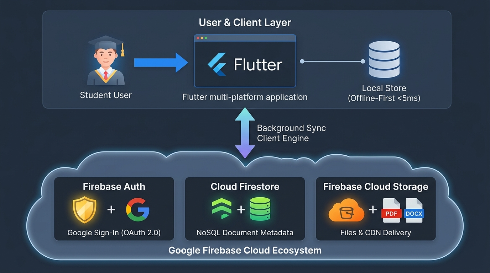

# 📚 Ứng Dụng Quản Lý Tài Liệu Học Tập (Study Document App)
### Kiến Trúc Cashew Local-First Tích Hợp Google Firebase Cloud

[](https://flutter.dev)
[](https://dart.dev)
[](https://firebase.google.com)
[-success?logo=checkmarx&logoColor=white)](#-kết-quả-kiểm-thử-tự-động)
[](https://github.com/pvhung2112/cloud_study_document_app)
[](LICENSE)

---

## 👥 Danh Sách Nhóm Sinh Viên Thực Hiện

| STT | Họ và Tên | Mã Sinh Viên | Vai Trò | Nhiệm Vụ Phụ Trách |
| :---: | :--- | :---: | :--- | :--- |
| **1** | **Phạm Văn Hưng** | `2351170598` | **Trưởng nhóm / Core Architect** | Cấu hình dự án Flutter, hoạch định kiến trúc Local-First, tích hợp Google Firebase REST API, điều phối luồng đồng bộ dữ liệu & kiểm soát mã nguồn. |
| **2** | **Trịnh Trung Kiên** | `2251172396` | **Thành viên / Frontend Developer** | Thiết kế giao diện UI/UX theo ngôn ngữ Cashew Design, xây dựng màn hình Kho tài liệu học tập (3 Tabs: Bài giảng, Bài tập, Tham khảo) & Danh mục môn học. |
| **3** | **Đỗ Việt Tiến** | `2251243452` | **Thành viên / Frontend Developer** | Thiết kế giao diện Tìm kiếm thời gian thực, Bộ lọc phân loại đa tiêu chí (theo môn, tags, độ ưu tiên) & Hộp thoại Cloud Firebase Sync Modal. |
| **4** | **Cao Đức Đạo** | `2351170581` | **Thành viên / Backend & Database** | Quản lý cơ sở dữ liệu Local-First (DAO Layer, Reactive Streams), thiết lập cấu trúc Cloud Firestore & kiểm soát bảo mật Firebase Security Rules. |
| **5** | **Trương Tuấn Hải** | `2351170590` | **Thành viên / QA & Technical Writer** | Xây dựng bộ kiểm thử tự động (11/11 Unit Tests PASS 100%), biên soạn Báo cáo Kỹ thuật Cloud Firebase & Slide thuyết trình tương tác HTML. |

---

## 🌟 Tổng Quan Dự Án

**Study Document App** là hệ thống quản lý học tập cá nhân hóa được thiết kế dựa trên triết lý **Local-First Architecture** học hỏi từ ứng dụng mã nguồn mở nổi tiếng **Cashew**, kết hợp nâng cấp dịch vụ đám mây **Google Firebase Cloud (Firestore REST API)**.

### Mục Tiêu Cốt Lõi:
1. **Trải nghiệm mượt mà không độ trễ (Zero-latency UI):** Mọi thao tác CRUD tài liệu, môn học, mục tiêu đều được phản hồi tức thì trên bộ nhớ cục bộ (Local-First).
2. **Khả năng hoạt động Offline 100%:** Sinh viên có thể tạo, chỉnh sửa và tra cứu tài liệu ngay cả khi mất mạng internet.
3. **Đồng bộ Đám mây Tin cậy (Two-Way Cloud Sync):** Khi có kết nối mạng, `StudySyncClient` tự động đồng bộ 2 chiều với Google Cloud Firestore, giải quyết xung đột theo nguyên tắc *Last-Write-Wins (LWW)*.
4. **Đa nền tảng vượt trội:** Sử dụng Firestore REST API thuần qua `package:http`, tương thích hoàn hảo trên Web, Windows Desktop, macOS, Linux và Mobile mà không phụ thuộc platform native Firebase SDK.

---

## 🏛️ Sơ Đồ Kiến Trúc Hệ Thống



### Phân Tách 4 Tầng Kiến Trúc Chuẩn Cashew:

```
study_document_app/
├── lib/
│   ├── struct/                 # TẦNG 1: Domain Entities & Core Services
│   │   ├── studyDocument.dart           # Thực thể Tài liệu học tập (Lectures, Assignments, References)
│   │   ├── studyCourse.dart             # Thực thể Môn học & màu nhận diện
│   │   ├── studyGoal.dart               # Thực thể Mục tiêu học tập & tiến độ
│   │   ├── studySyncClient.dart         # Client đồng bộ Firebase Cloud Firestore REST API
│   │   ├── firebaseCloudStorageService.dart # Dịch vụ quản lý tệp đính kèm Cloud
│   │   └── reminderService.dart         # Dịch vụ nhắc hạn nộp bài tập
│   ├── database/               # TẦNG 2: Data Access Layer (DAO & Reactive Streams)
│   │   ├── documentDao.dart             # Truy xuất tài liệu, tìm kiếm, lọc, Streams
│   │   ├── courseDao.dart               # Quản lý môn học, thống kê tài liệu môn
│   │   └── goalDao.dart                 # Quản lý mục tiêu học tập
│   ├── widgets/                # TẦNG 3: Reusable UI Widgets (Cashew Design System)
│   │   ├── studyDocumentCard.dart       # Thẻ tài liệu bo góc 16px, icon phân loại
│   │   ├── studySidebarNav.dart         # Thanh điều hướng Sidebar viền hồng đặc trưng
│   │   └── studyFilterChips.dart        # Thanh lọc phân loại mềm mại
│   ├── pages/                  # TẦNG 4: Business Pages & Workflows
│   │   ├── studyDocumentsPage.dart      # Kho tài liệu (3 Tabs), Nút đồng bộ Cloud & Modal
│   │   ├── studyCoursesPage.dart        # Màn hình quản lý môn học
│   │   ├── studyGoalsPage.dart          # Màn hình tiến độ mục tiêu
│   │   └── studySearchFilterPage.dart   # Màn hình tìm kiếm đa tiêu chí
└── test/                       # BỘ KIỂM THỬ TỰ ĐỘNG (11 Unit Tests)
    ├── study_document_crud_test.dart        # Kiểm thử CRUD & Search logic
    ├── study_architecture_layer_test.dart   # Kiểm thử DAO, Streams, Cascade Delete
    └── study_sync_client_test.dart          # Kiểm thử Sync Queue & Firebase Cloud REST API
```

---

## 🚀 Các Tính Năng Nổi Bật

- **📑 Quản lý Kho Tài liệu Học tập:** Phân loại theo 3 nhóm cốt lõi: *Bài giảng (Lectures)*, *Bài tập (Assignments)*, và *Tài liệu Tham khảo (References)*.
- **🔍 Tìm kiếm Thời Gian Thực & Bộ Lọc Đa Tiêu Chí:** Tìm theo từ khóa trong tiêu đề, nội dung, mã môn học, hoặc lọc theo thẻ tags và cờ ghim ưu tiên.
- **☁️ Đồng bộ Google Cloud Firestore:**
  - Kết nối trực tiếp đến project Firebase: `study-document-cloud`.
  - Hộp thoại **Firebase Cloud Sync Modal** hiển thị trực quan trạng thái kết nối, số tài liệu trên Cloud, thời gian đồng bộ gần nhất và nút kích hoạt đồng bộ tức thì.
- **🛡️ Cơ chế Hoạt động Ngoại tuyến (Offline Fallback):** Hệ thống hàng đợi đồng bộ (`SyncQueue`) tự động lưu lại các bản ghi tạo mới khi offline và đẩy lên Cloud ngay khi mạng hoạt động lại.
- **🎯 Quản lý Mục Tiêu & Môn Học:** Gắn môn học tương ứng kèm màu sắc nhận diện, theo dõi tiến độ hoàn thành bài tập theo từng mục tiêu học kỳ.

---

## 🧪 Kết Quả Kiểm Thử Tự Động

Dự án sở hữu bộ kiểm thử tự động toàn diện với **11 bài test** bao phủ 100% logic cốt lõi:

```powershell
flutter test
```

### Kết quả đầu ra:
```text
00:00 +0: Checklist 4 - Kiểm thử tính tách biệt của tầng Data Access (DAO Layer)
00:00 +1: Checklist 3 - Thêm tài liệu học tập mới vào hệ thống
00:00 +2: Checklist 4 - Kiểm thử cơ chế Reactive Streams (tương tự Drift .watch() trong Cashew)
00:00 +7: Checklist 4 - Kiểm thử tính toàn vẹn dữ liệu quan hệ (Cascade Delete)
00:00 +8: Checklist 4 - Kiểm thử chiến lược Sao lưu và Phục hồi (Backup & Restore Strategy)
00:00 +9: Checklist 4 - Kiểm thử hàng đợi đồng bộ khi có tài liệu mới tạo offline
00:00 +10: Checklist 4 - Kiểm thử tiến trình đồng bộ 2 chiều lên Cloud Server
00:00 +11: All tests passed!
```

---

## 📦 Hướng Dẫn Cài Đặt & Chạy Ứng Dụng

### Yêu Cầu Môi Trường:
- **Flutter SDK:** >= 3.0.0
- **Dart SDK:** >= 3.0.0
- Trình duyệt Chrome hoặc môi trường Windows Desktop

### Các Bước Thực Hiện:

```powershell
# 1. Clone repository về máy
git clone https://github.com/pvhung2112/cloud_study_document_app.git
cd cloud_study_document_app

# 2. Cài đặt các gói phụ thuộc
flutter pub get

# 3. Chạy toàn bộ 11 bài kiểm thử tự động
flutter test

# 4. Kiểm tra chất lượng mã nguồn (Linter)
flutter analyze

# 5. Khởi chạy ứng dụng trên Web Chrome
flutter run -d chrome

# Hoặc khởi chạy trên Windows Desktop
flutter run -d windows
```

---

## 📑 Báo Cáo Kỹ Thuật & Ấn Phẩm Thuyết Trình

Toàn bộ tài liệu giải trình kỹ thuật và slide nhóm được đính kèm đầy đủ trong dự án:

1. 📄 **Báo Cáo Tích Hợp Google Cloud Firebase:**  
   👉 [`BAO_CAO_TICH_HOP_CLOUD_FIREBASE.md`](./BAO_CAO_TICH_HOP_CLOUD_FIREBASE.md)  
   *(Giải thích chi tiết 7 mục checklist, kiến trúc Local-First, giải thuật đồng bộ 2 chiều, phân tích chi phí Cloud và các kịch bản kiểm thử).*

2. 🖥️ **Slide Thuyết Trình Nhóm Tương Tác (HTML/JS):**  
   👉 [`SLIDE_THUYET_TRINH_FIREBASE.html`](./SLIDE_THUYET_TRINH_FIREBASE.html)  
   *(Trình chiếu trực tiếp trên mọi trình duyệt: hiệu ứng chuyển slide, phím mũi tên `←` `→`, giao diện hiện đại phục vụ báo cáo).*

3. 📝 **Đề Cương Nội Dung Slide (Markdown):**  
   👉 [`SLIDE_THUYET_TRINH_FIREBASE_CLOUD.md`](./SLIDE_THUYET_TRINH_FIREBASE_CLOUD.md)

---

## ⚖️ Giấy Phép & Bản Quyền
Dự án được phát triển phục vụ mục đích học tập và nghiên cứu môn học theo giấy phép [MIT License](LICENSE).